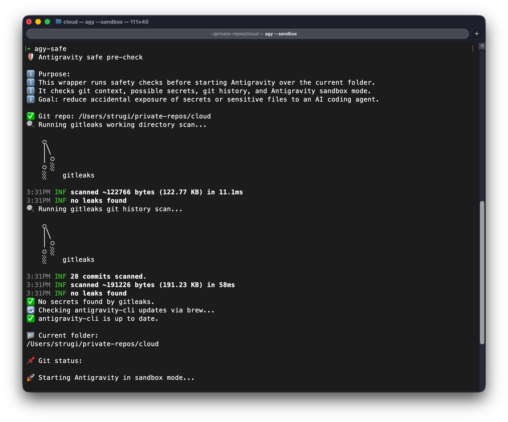

# Antigravity (Gemini) and Codex CLI Security Wrapper

## Purpose
This repository documents and maintains security wrapper functions (`agy-safe` and `codex-safe`) for the Antigravity (Gemini) and Codex CLIs. The wrapper runs essential safety checks before starting the agent in the current folder. Its goal is to reduce the accidental exposure of secrets or sensitive files to an AI coding agent by enforcing git context checks, secret scanning, and running the agent in sandbox mode.

## Dependencies

| Tool | Required | Purpose | Installation |
|---|---:|---|---|
| `zsh` | Yes | Runs the `agy-safe` and `codex-safe` shell functions | Included with macOS |
| `git` | Yes | Repository context, status and history checks | `brew install git` |
| `gitleaks` | Yes | Scans the working directory and Git history for potential secrets | `brew install gitleaks` |
| `brew` | Yes | Installs Gitleaks and checks for CLI updates | Install Homebrew separately |
| `agy` | Yes | Starts the Antigravity CLI in sandbox mode | Install Antigravity CLI and ensure `agy` is available in `$PATH` |
| `codex` | Optional | Starts the Codex CLI in sandbox mode | Install Codex CLI and ensure `codex` is available in `$PATH` |

```bash
command -v zsh git gitleaks brew agy codex
```

## Existing `.zshrc` Configuration
The wrapper is implemented as shell functions named `agy-safe` and `codex-safe` (with a legacy alias `gemini-safe`) inside `~/.zshrc`. 

## Security Checks

> [!WARNING]
> Use this wrapper at your own risk. It can help reduce the chance of accidentally exposing secrets, but it is not a complete security boundary and does not guarantee safe usage of Gemini CLI.
>
> Security depends on careful use of the tool and basic security hygiene. Always review the directory in which the CLI is started, keep credentials and sensitive files outside project directories where possible, use least-privilege credentials, review requested permissions, and rotate any credential that may have been exposed.
>
> Secret scanning and sandboxing reduce risk, but they do not replace responsible usage, access controls, secure credential storage, and manual review.
Before launching the CLI, the wrapper performs the following checks:
1. **Git Context Check**: Verifies if the current folder is a git repository (`git rev-parse --is-inside-work-tree`). If not, it prompts the user to confirm before proceeding.
2. **Secret Scan (Working Directory)**: Runs `gitleaks dir . --redact --verbose --timeout 120` to detect exposed secrets in the current directory.
3. **Secret Scan (Git History)**: Runs `gitleaks git . --redact --verbose --timeout 120` to detect exposed secrets in the repository's commit history.
4. **CLI Update Check**: Uses `brew outdated` to check if `antigravity-cli` needs an update, prompting the user to upgrade if a newer version is available.
5. **Context Summary**: Prints the current working directory (`pwd`) and git status (`git status --short`).
6. **Sandbox Execution**: Launches the CLI using sandbox mode (`agy --sandbox "$@"` or `codex --sandbox workspace-write "$@"`).

## How It Works

```text
agy-safe / codex-safe
   |
   +-- Check Git repository context
   +-- Scan the working directory with Gitleaks
   +-- Scan Git history with Gitleaks
   +-- Check for an Antigravity CLI update when using `agy-safe`
   +-- Display the current directory and Git status
   +-- Start the selected CLI in sandbox mode
```

## Demo



The screenshot shows an example of the wrapper completing its pre-flight checks before starting Antigravity CLI.

## Usage Examples

Run the wrapper normally:
```bash
agy-safe
```

Run Codex with the same pre-flight checks:
```bash
codex-safe
```

Run with arguments passed to the Antigravity CLI:
```bash
agy-safe --task "Fix the build"
```

Run with arguments passed to the Codex CLI:
```bash
codex-safe "Fix the build"
```

Use the legacy alias (redirects to `agy-safe`):
```bash
gemini-safe
```

Override secret scan findings to force execution:
```bash
AGY_SAFE_ALLOW_RISK=1 agy-safe
```
For Codex:
```bash
CODEX_SAFE_ALLOW_RISK=1 codex-safe
```
*(Alternatively, `GEMINI_SAFE_ALLOW_RISK=1` can still be used).*

## Troubleshooting
- **`gitleaks is not installed`**: The wrapper will prompt to install it via `brew`. If `brew` is missing, you must install `gitleaks` manually.
- **`Possible secrets found`**: The wrapper halts execution to help reduce risk. Review the findings from `gitleaks`. If you are certain it's a false positive, you can override using `AGY_SAFE_ALLOW_RISK=1` or `CODEX_SAFE_ALLOW_RISK=1`.
- **`agy CLI is not installed`**: Ensure the Antigravity CLI is installed and available in your shell's `$PATH`.
- **`codex CLI is not installed`**: Ensure the Codex CLI is installed and available in your shell's `$PATH`.

## Updating the Wrapper
To modify the wrapper, edit the safe wrapper functions in your `~/.zshrc`. 
Always back up `.zshrc` before making changes:
```bash
cp ~/.zshrc ~/.zshrc.backup
```
And validate syntax after changes:
```bash
zsh -n ~/.zshrc
source ~/.zshrc
```
