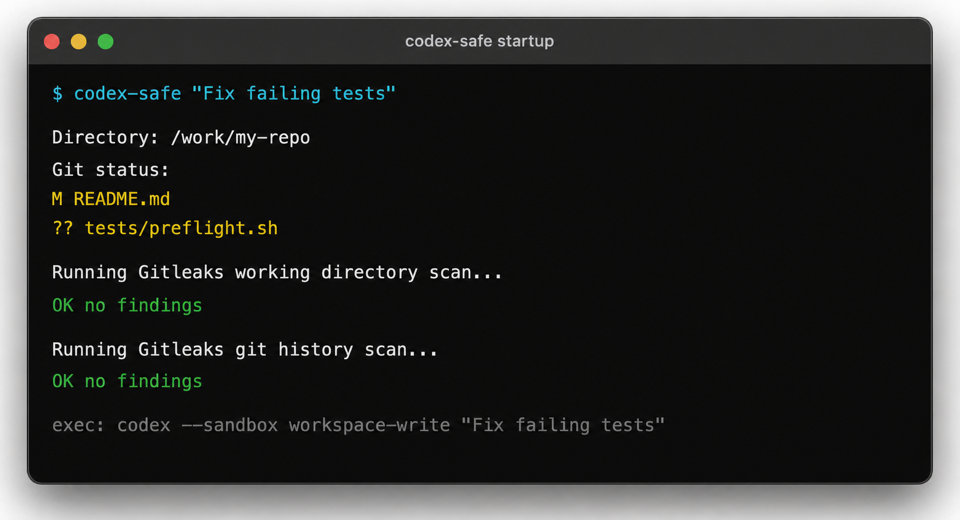

# AI CLI Wrapper

[](https://github.com/mstrugarevic1/ai-cli-wrapper/actions/workflows/checks.yml)

Small shell wrappers for people who run AI coding tools directly inside Git
repositories and want the same safety check every time.

The wrapper's job is simple: before `agy`, `codex`, or `claude` starts, it makes
sure you are in a Git repository, shows the directory and current Git state, and
runs Gitleaks against both the working tree and Git history. If Gitleaks finds
something, the AI CLI does not start unless you explicitly override it.

This is a local guardrail for catching common mistakes before an AI tool reads
the repository.



Supported commands:

```zsh
agy-safe
gemini-safe
codex-safe
claude-safe
```

`gemini-safe` is kept as a legacy alias for `agy-safe`.

## Install

```zsh
git clone https://github.com/mstrugarevic1/ai-cli-wrapper.git ~/.config/ai-cli-wrapper-source
cd ~/.config/ai-cli-wrapper-source
./install.sh
source ~/.zshrc
```

Choose a shell explicitly when needed:

```zsh
./install.sh zsh
./install.sh bash
./install.sh both
```

The installer copies `scripts/ai-safe.sh` to
`~/.config/ai-cli-wrapper/scripts/ai-safe.sh` and adds this source line to the
selected rc file:

```zsh
source ~/.config/ai-cli-wrapper/scripts/ai-safe.sh
```

It backs up the rc file to `<rc>.ai-cli-wrapper.backup` before changing it.

## Use

Run the wrapper from inside the repository you want the AI CLI to inspect:

```zsh
agy-safe --prompt "Review this repository"
codex-safe "Fix failing tests"
claude-safe
```

Before the CLI starts, the wrapper:

- requires a Git repository (override with `AI_SAFE_ALLOW_NO_GIT=1`)
- prints the current directory and `git status --short`
- scans the repository root with `gitleaks dir`
- scans Git history with `gitleaks git`
- blocks on Gitleaks findings

Details: [docs/security-model.md](docs/security-model.md)

## Requirements

Install the shell and tools you use:

- `zsh` or `bash`
- `git`
- `gitleaks`
- `agy`, `codex`, or `claude`

If Gitleaks is missing, the wrapper can install it with Homebrew.

## Update

```zsh
cd ~/.config/ai-cli-wrapper-source
make update
```

To update both shell rc files after pulling:

```zsh
./install.sh both
```

## Uninstall

Remove this line from `~/.zshrc` or `~/.bashrc`:

```zsh
source ~/.config/ai-cli-wrapper/scripts/ai-safe.sh
```

Then remove the installed copy:

```zsh
rm -rf ~/.config/ai-cli-wrapper
```

## Validate

```zsh
make lint
```

## Disclaimer

Use this at your own risk. This wrapper is not a security boundary, Gitleaks can
miss secrets, and CLI sandbox behavior depends on the installed CLI version. Do
not run AI coding tools inside repositories that contain real secrets.
